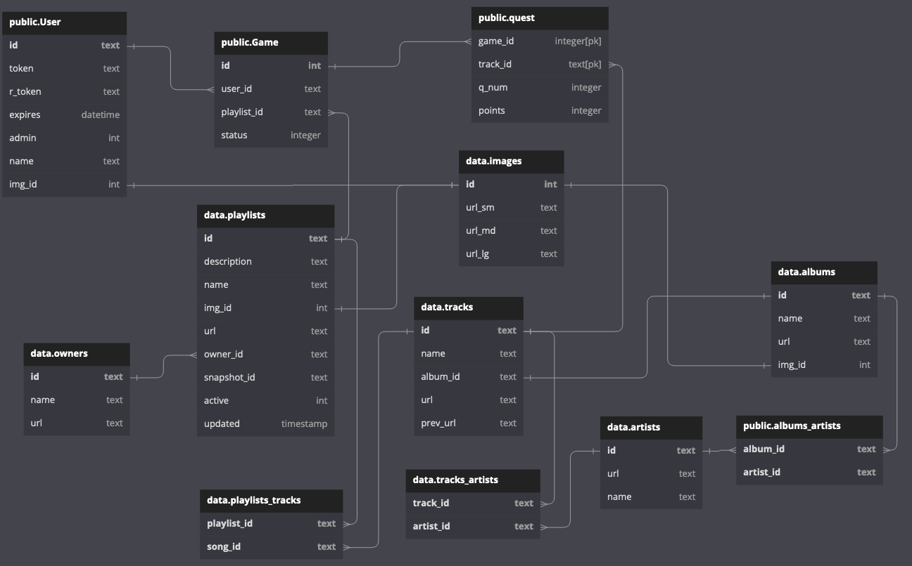

# SongGeek
## A musical quiz based on Spotify API

Score points by recognizing songs from playlists featured by Spotify. Add songs to your Spotify Library.

### Technologies:
- Flask
- SQLAlchemy
- Spotify API
- OAuth 2.0
- Python
- HTML/CSS/JS
- Bootstrap

SongGeek is a Flask web application. Score points by recognizing songs from Spotify playlists. 

SongGeek is currently in development mode, and maximum user count is restricted by Spotify. Contact me at jakub@jlipinski.pl if you would like to log in. The app is available at [SongGeek.herokuapp.com](https://songgeek.herokuapp.com/).

# User story

## Log into the SongGeek using your Spotify account

## Select a country
SongGeek will display Spotify playlists currently featured in selectetd country.

## Select a playlist and start quiz
You will be presented with five song snippets from selected playlist. The faster you recognize the song, the more points you gain. Each playlist has a SongGeek level assigned dynamically, based on an average score. Hard level multiplies your points x2, and easy level devides by /2.
### Main board - select a playlist

### Start a quiz

### Correct answer

### Incorrect answer

## Add songs to your Spotify Library
After answering quiz question you'll be presented with a summary, which lets you add songs from the quiz to your Spotify Library. It's a great way to discovering new music!

## Check your ranking!
Find yourself on a leaderboard

## Check your personal stats
See what songs and artists you recognize the most easilly. Brownse playlists you've championed!

# File list
- ### config.py

App configuration file. Also reads some enviromental variables.

- ### requirements.txt

Python libraries list, file generated by pip freee

- ### app/__init__.py

Flask app module loader.

- ### errors.py

Flask custom error rutes, for 400 and 500 errors.

- ### helpers.py

Helper functions, I make use of them in routes and models.

- ### routes.py

Main flask routing file. I use caching for some API and DB requests that don't need to be updated that often. 

- ### models.py

SQLAlchemy models file. Here are object models for my database, along with some custom methods I have written for them. 

Database diagram

- ### static/featured.js

Javascript for main page, mostly fetching featured playlists via flask app on server.

- ### static/quiz-results.js

JS for quiz result paga. Handles song preview and like/unlike song requests.

- ### static/quiz.js

JS for quiz itself. First i fetch quest from the app, then load audio for songs. After loading first quest audio, display answer options, allow playback and wait for the answer. Start playback from a random position (of 30s snippet provided by Spotify API). Except for the first song, which starts in 1-4s range for faster loading. After playback start countdown from 5s to 0. Send answer id and user time and wait for server response. Display outcome, and show next quest. After five quests, display a link to quiz results.

- ### static/ranking.js

JS fetching ranking from the app.

- ### static/scripts.js

Common functions, mostly remembering a valume setting in session storage, and setting it on page load.

- ### static/*.css

CSS files for styling a page. Most of the style is Bootstrap, but there are some custom elements.

- ### templates/layout.html
JINJA2 file, basic layout for the page. Provides container, navbar and the footer

- ### templates/*.html
Templates for each different views

