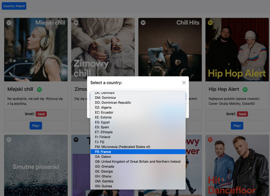
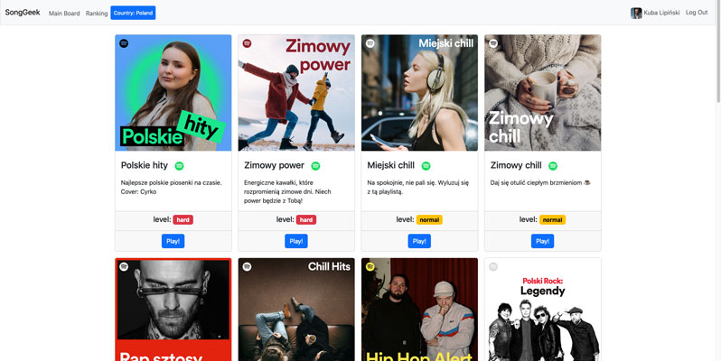
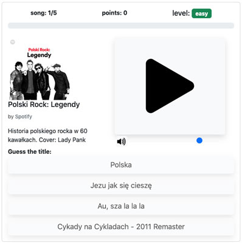
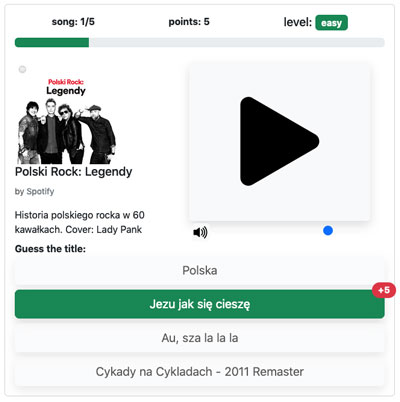
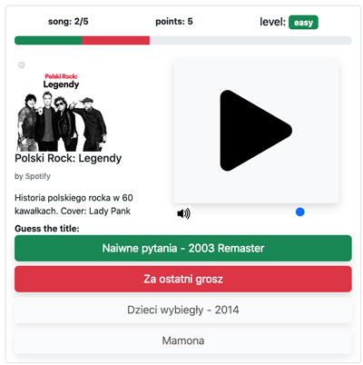
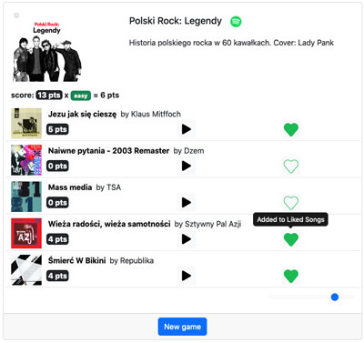
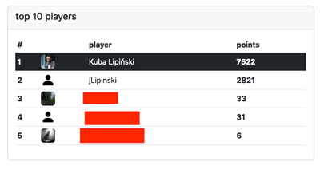
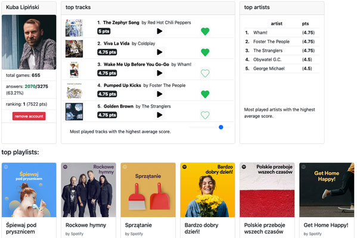

# SongGeek
## A musical quiz based on Spotify API

Score points by recognizing songs from playlists featured by Spotify. Add songs to your Spotify Library.

### Technologies:
- Flask
- SQLAlchemy
- Spotify API
- OAuth 2.0
- Python
- HTML/CSS/JS
- Bootstrap

SongGeek is a Flask web application. Score points by recognizing songs from Spotify playlists.

# User story

## Log into the SongGeek using your Spotify account

## Select a country
SongGeek will display Spotify playlists currently featured in selectetd country.

## Select a playlist and start quiz
You will be presented with five song snippets from selected playlist. The faster you recognize the song, the more points you gain. Each playlist has a SongGeek level assigned dynamically, based on an average score. Hard level multiplies your points x2, and easy level devides by /2.
### Main board - select a playlist

### Start a quiz

### Correct answer

### Incorrect answer

## Add songs to your Spotify Library
After answering quiz question you'll be presented with a summary, which lets you add songs from the quiz to your Spotify Library. It's a great way to discovering new music!

## Check your ranking!
Find yourself on a leaderboard

## Check your personal stats
See what songs and artists you recognize the most easilly. Brownse playlists you've championed!

